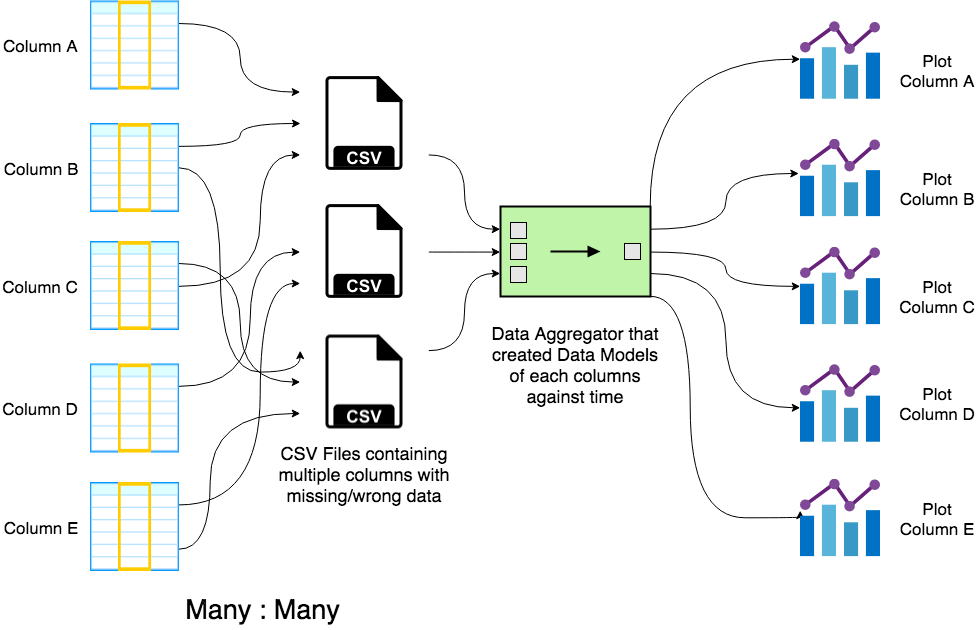

### Overview
* This is a CSV to Graph app above all.
* The main task of this app is to read multiple CSV files, aggregate and consolidate their data by columns against datetime and plot them in dynamic graphs.

### Requirements
* It should be able to read from multiple similar files as if they are the same. e.g. CallData_*.csv
* File names could contain data too and should be considered when parsing. e.g. data/time
* Some of the rows might contain wrong data in the column, or might miss some columns. Those should be parsed correctly.
* All data will be mapped against datetime which needs to be present and linked with the data.

### High Level Overview

#### Graphs (Per Day, Per Week, Per Month)
* Battery
  - Total Battery Charged time
  - Time Points when Battery was full
  - Total minutes when Battery stayed Full
  - Time Points when Battery was < 5%
  - Total minutes when Battery was < 5%

### Low Level Design

#### Entities
* DataTypes
    * RowDatetime
        - ZonedDateTime
            + Day
            + Month
            + Year
            + Hour
            + Minute
    * Battery (integer)
    * Bluetooth Status (off/on)
    * CPU Frequency (integer)
    * Cell Signal (integer)
    * Brightness (integer)
    * Free Memory (integerMB)
    * Location (%LOC if data is errored)
        - Latitude (double)
        - Longitude (double)
    * Wifi Status (off/on)
    * Display Status (off/on/unlocked)
    * IncomingCall
        - CNAME
        - CNUM
    * MissedCall
        - CNAME
        - CNUM
    * OffhookStart (dialing, active, or on hold starts)
        - CONAME
        - CONUM
    * OffhookEnd (dialing, active, or on hold ends)
        - CONAME
        - CONUM
        - CODUR
    * LocationMarkers
        - ReachedHome (constant)
        - LeftHome (constant)
        - ReachedOffice (constant)
        - LeftOffice (constant)
* File
	* Path (string)
    * NameRegex
    * parseRow()
        - Conditional row parser that parses string of the row to a FileRow*.
    * All Possible FileRows that could be present in the file
* FileRow
    - This is an interface which all file rows will extend to.
    - All FileRows need to have datetime.